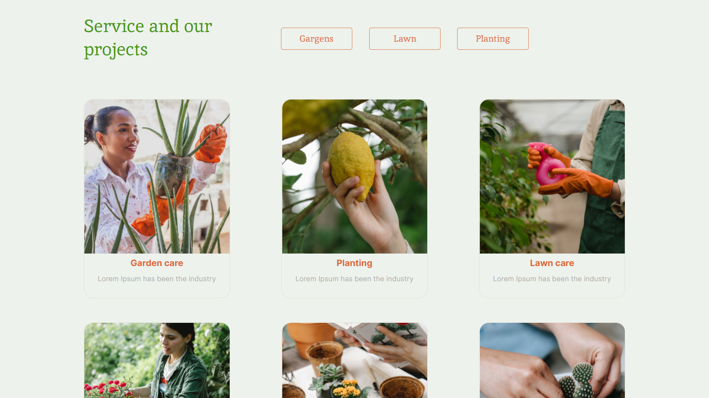

# [Plants](https://romanchuchev.github.io/plants/)

## Адаптивная Pixel Perfect верстка [макета из Figma: Plants](https://www.figma.com/file/ntVt8IwlwzfVFMBuVVAze8/Plants?node-id=0%3A1&t=Pr55BfwanuOYrYxn-0) с использованием сборки Gulp + WebPack + Babel

---

## Запустить проект

#### `git clone https://github.com/RomanChuchev/plants.git`

#### `npm i`

#### `gulp`

---

